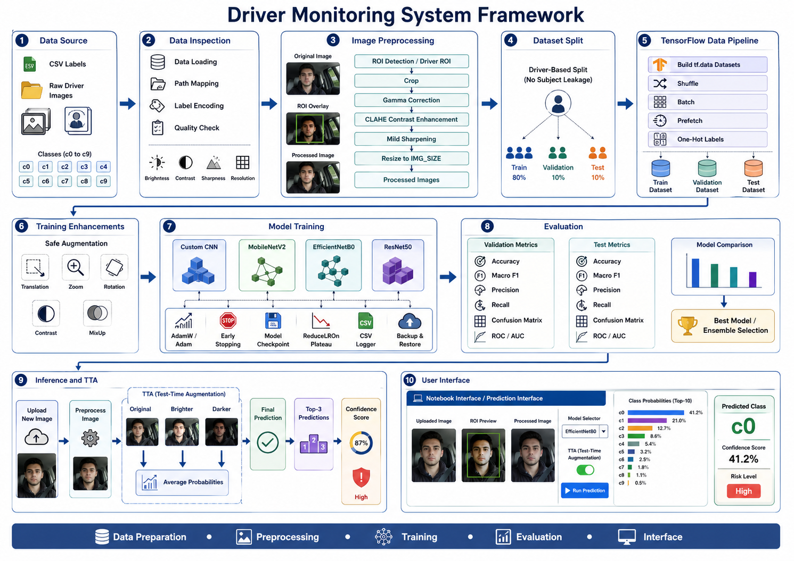

# Driver Monitoring System

A deep learning project for detecting distracted driving behavior from in-car driver images.

The system classifies a driver image into one of ten behavior classes. It also shows the predicted behavior, confidence score, risk level, image quality metrics, top predictions, and a final decision.

The project uses the State Farm Distracted Driver Detection dataset from Kaggle.

Dataset page


https://www.kaggle.com/competitions/state-farm-distracted-driver-detection/data


---

# Project Summary

This project builds a driver monitoring system using computer vision and deep learning.

The system receives an image of a driver inside a car and predicts the driver's behavior.

It can detect safe driving and multiple distracted driving actions.

The project includes the full machine learning workflow.

```text
Data Source
Data Inspection
Image Preprocessing
Dataset Split
TensorFlow Data Pipeline
Training Enhancements
Model Training
Evaluation
Inference and Test-Time Augmentation
Gradio User Interface
Prediction Logging
```

---

# System Framework

## System Framework

The full workflow is shown in the system framework image.




---

# Dataset

The project uses the State Farm Distracted Driver Detection dataset.

The dataset contains driver images captured inside a car.

Each image belongs to one of ten classes.

| Class | Behavior |
|---|---|
| c0 | Safe driving |
| c1 | Texting right |
| c2 | Talking on the phone right |
| c3 | Texting left |
| c4 | Talking on the phone left |
| c5 | Operating the radio |
| c6 | Drinking |
| c7 | Reaching behind |
| c8 | Hair and makeup |
| c9 | Talking to passenger |

---

# Problem Statement

Driver distraction increases road risk.

The goal of this project is to classify driver behavior from a single image.

The system predicts the behavior class and assigns a risk level.

The final output helps identify whether the driver appears safe, distracted, high risk, or uncertain.

---

# Risk Levels

The system groups the predicted classes into risk categories.

| Risk Level | Classes |
|---|---|
| Safe | c0 |
| Distracted | c1, c2, c3, c4, c5, c6, c8, c9 |
| High Risk | c7 |
| Uncertain | Low-confidence predictions |

The final decision uses the predicted class, confidence score, and confidence margin.

---

# Main Features

- Image upload
- Driver behavior classification
- Driver ROI preprocessing
- Image quality analysis
- Model selection
- Ensemble prediction
- Test-time augmentation
- Top 3 predictions
- Confidence score
- Risk level
- Decision card
- Probability chart
- Top 3 ranking chart
- Image quality chart
- Decision score chart
- Prediction logging
- Gradio interface

---

# Project Structure

Recommended repository structure.

```text
driver-monitoring-system/
│
├── README.md
├── requirements.txt
├── requirements_optimized.txt
├── environment.yml
│
├── driver_monitoring_system_optimized.ipynb
├── driver_monitoring_app.py
│
├── driver_imgs_list.csv
│
├── imgs/
│   ├── train/
│   │   ├── c0/
│   │   ├── c1/
│   │   ├── c2/
│   │   ├── c3/
│   │   ├── c4/
│   │   ├── c5/
│   │   ├── c6/
│   │   ├── c7/
│   │   ├── c8/
│   │   └── c9/
│   │
│   └── test/
│
├── driver_monitoring_outputs/
│   ├── data/
│   │   ├── driver_based_split_80_10_10.csv
│   │   ├── quality_report_all_train_images.csv
│   │   ├── quality_before_after_all_train_images.csv
│   │   ├── roi_annotations_all_train_images.csv
│   │   ├── model_validation_summary.csv
│   │   ├── best_model_classification_report.json
│   │   └── interface_prediction_log.csv
│   │
│   ├── models/
│   │   ├── custom_cnn/
│   │   │   └── best.keras
│   │   ├── mobilenetv2/
│   │   │   └── best.keras
│   │   ├── efficientnetb0/
│   │   │   └── best.keras
│   │   └── resnet50/
│   │       └── best.keras
│   │
│   └── figures/
│
└── docs/
    └── system-framework.png
```

---

# Main Files

## driver_monitoring_system_optimized.ipynb

Main notebook for the full training and evaluation pipeline.

It includes:

- Data loading
- Data inspection
- Image path mapping
- Label encoding
- Image preprocessing
- Quality checks
- Dataset split
- TensorFlow dataset creation
- Model training
- Model evaluation
- Model saving
- Inference testing
- Interface testing

## driver_monitoring_app.py

Optional Python app for running the prediction interface outside the notebook.

## driver_imgs_list.csv

CSV label file from the Kaggle dataset.

It contains:

- Driver subject ID
- Class name
- Image filename

## requirements.txt

Base dependency file.

## requirements_optimized.txt

Optimized dependency file for notebook execution.

## environment.yml

Conda environment file.

## driver_monitoring_outputs

Generated project outputs.

It stores processed files, saved models, logs, reports, and evaluation results.

---

# Installation

## Option 1: Using pip

Create a virtual environment.

```bash
python -m venv .venv
```

Activate it on Windows.

```bash
.venv\Scripts\activate
```

Activate it on Linux or macOS.

```bash
source .venv/bin/activate
```

Upgrade pip.

```bash
python -m pip install --upgrade pip
```

Install the required packages.

```bash
python -m pip install -r requirements_optimized.txt
```

Install Gradio if it is not included.

```bash
python -m pip install gradio
```

---

## Option 2: Using Conda

Create the environment.

```bash
conda env create -f environment.yml
```

Activate the environment.

```bash
conda activate driver-monitoring
```

Install Gradio if needed.

```bash
pip install gradio
```

---

# Dependencies

Main packages used in this project.

```text
tensorflow-cpu==2.15.0
scikit-learn==1.4.2
numpy==1.26.4
pandas==2.2.2
matplotlib==3.9.0
seaborn==0.13.2
opencv-python==4.9.0.80
Pillow==10.3.0
ipykernel==6.29.4
notebook==7.2.0
jupyterlab==4.2.0
tqdm==4.66.4
ipywidgets==8.1.3
gradio
```

---

# Dataset Setup

Download the dataset from Kaggle.

```text
https://www.kaggle.com/competitions/state-farm-distracted-driver-detection/data
```

After extraction, keep this structure.

```text
driver-monitoring-system/
├── driver_imgs_list.csv
└── imgs/
    ├── train/
    │   ├── c0/
    │   ├── c1/
    │   ├── c2/
    │   ├── c3/
    │   ├── c4/
    │   ├── c5/
    │   ├── c6/
    │   ├── c7/
    │   ├── c8/
    │   └── c9/
    └── test/
```

Do not upload the dataset to GitHub.

The dataset should stay outside version control because of size and license limits.

---

# Data Inspection

The data inspection stage checks the dataset before training.

It performs:

- CSV loading
- Class distribution check
- Driver distribution check
- Image path mapping
- Missing file detection
- Label encoding
- Image quality inspection

This step helps detect data problems before model training.

---

# Image Preprocessing

The preprocessing stage prepares each image for model input.

Main steps:

```text
Original image
ROI detection
Crop driver region
Gamma correction
CLAHE contrast enhancement
Mild sharpening
Resize to model input size
Processed image
```

The model input size is:

```text
160 x 160
```

The preprocessing function also calculates image quality metrics before and after processing.

---

# Image Quality Metrics

The system calculates these metrics:

| Metric | Meaning |
|---|---|
| Brightness | Average image light intensity |
| Contrast | Standard deviation of grayscale intensity |
| Sharpness | Laplacian variance |
| Width | Image width |
| Height | Image height |

These metrics help show how preprocessing changed the image.

---

# Dataset Split

The project uses a driver-based split.

This prevents the same driver from appearing in train, validation, and test sets at the same time.

Split ratio:

| Split | Percentage |
|---|---|
| Train | 80 percent |
| Validation | 10 percent |
| Test | 10 percent |

A driver-based split is more realistic than a random image split.

It reduces subject leakage.

---

# TensorFlow Data Pipeline

The TensorFlow pipeline prepares data for training.

It includes:

- Image reading
- Image decoding
- Resize
- Label encoding
- One-hot labels
- Shuffle
- Batch
- Prefetch

This improves training speed and keeps the workflow organized.

---

# Training Enhancements

The training process can use:

- Safe augmentation
- Translation
- Zoom
- Rotation
- Contrast adjustment
- MixUp
- Early stopping
- Model checkpointing
- ReduceLROnPlateau
- CSV logger
- Backup and restore

These techniques help improve generalization and reduce overfitting.

---

# Models

The project trains and compares multiple models.

## Custom CNN

A custom convolutional neural network built from scratch.

Used as a baseline.

## MobileNetV2

A lightweight transfer learning model.

Useful when inference speed matters.

## EfficientNetB0

A transfer learning model that balances accuracy and efficiency.

## ResNet50

A deeper transfer learning model.

Useful for strong feature extraction.

## Ensemble

The ensemble combines predictions from multiple trained models.

The ensemble uses:

```text
MobileNetV2
EfficientNetB0
ResNet50
```

Example weights:

```python
weights = {
    "MobileNetV2": 0.34,
    "EfficientNetB0": 0.33,
    "ResNet50": 0.33
}
```

---

# Model Training

The training workflow includes:

1. Load processed training data
2. Build TensorFlow datasets
3. Apply augmentation
4. Initialize model
5. Train model
6. Save best checkpoint
7. Track training history
8. Evaluate on validation data
9. Save model results

Saved model path examples:

```text
driver_monitoring_outputs/models/custom_cnn/best.keras
driver_monitoring_outputs/models/mobilenetv2/best.keras
driver_monitoring_outputs/models/efficientnetb0/best.keras
driver_monitoring_outputs/models/resnet50/best.keras
```

---

# Evaluation

The project evaluates each model using validation and test data.

Metrics include:

- Accuracy
- Macro F1 score
- Precision
- Recall
- Confusion matrix
- ROC curve
- AUC score
- Classification report

Evaluation outputs are saved in:

```text
driver_monitoring_outputs/data/
```

Common output files:

```text
model_validation_summary.csv
best_model_classification_report.json
quality_report_all_train_images.csv
quality_before_after_all_train_images.csv
roi_annotations_all_train_images.csv
interface_prediction_log.csv
```

---

# Inference Pipeline

The inference pipeline predicts behavior for a new uploaded image.

Steps:

```text
Upload image
Preprocess image
Generate original, brighter, and darker versions
Predict class probabilities
Average probabilities
Select top class
Select top 3 predictions
Calculate confidence
Calculate risk level
Generate final decision
Save prediction log
```

---

# Test-Time Augmentation

Test-time augmentation improves prediction stability.

The system creates three image variants:

| Variant | Description |
|---|---|
| Original | Input image after preprocessing |
| Brighter | Image multiplied by 1.08 |
| Darker | Image multiplied by 0.92 |

The model predicts all variants.

The final probabilities are averaged.

---

# Decision Logic

The final interface does not only show the predicted class.

It generates a decision using:

- Predicted class
- Risk group
- Confidence score
- Top 2 class confidence
- Confidence margin

Reliability rules:

| Condition | Reliability |
|---|---|
| Confidence at least 80 percent and margin at least 20 percent | High |
| Confidence at least 60 percent and margin at least 10 percent | Medium |
| Otherwise | Low |

Decision rules:

| Condition | Decision |
|---|---|
| Confidence below 50 percent | Uncertain Result |
| Predicted class is c0 | Safe Driving Detected |
| Predicted class is c7 | High Risk Distraction Detected |
| Any other distracted class | Distraction Detected |

---

# Gradio User Interface

The project includes a Gradio interface.

The interface supports:

- Upload image
- Select model
- Enable or disable TTA
- Show original image
- Show ROI annotation
- Show processed input
- Show decision card
- Show risk level
- Show confidence
- Show reliability
- Show decision reason
- Show top 3 predictions
- Show class probability chart
- Show top 3 ranking chart
- Show image quality chart
- Show decision score chart
- Save prediction log

Supported model options:

```text
Ensemble
MobileNetV2
EfficientNetB0
ResNet50
Custom CNN
```

---

# Prediction Log

Each prediction is saved in this file.

```text
driver_monitoring_outputs/data/interface_prediction_log.csv
```

Logged columns include:

```text
timestamp
file_name
model
predicted_class
behavior
risk
decision
reliability
confidence
top2_class
top2_confidence
confidence_margin
brightness_before
contrast_before
sharpness_before
brightness_after
contrast_after
sharpness_after
```

---

# How to Run the Notebook

Start Jupyter Lab.

```bash
jupyter lab
```

Open the notebook.

```text
driver_monitoring_system_optimized.ipynb
```

Run the notebook cells in order.

The notebook will:

1. Load the dataset
2. Inspect the dataset
3. Preprocess images
4. Create the driver-based split
5. Build TensorFlow datasets
6. Train models
7. Evaluate models
8. Save model checkpoints
9. Run inference
10. Open the interface

---

# How to Run the App

If the interface is inside the notebook, run the final Gradio cell.

If the interface is saved as a Python file, run:

```bash
python driver_monitoring_app.py
```

Then open the local URL shown in the terminal.

Example:

```text
http://127.0.0.1:7860
```

---

# Model Loading Note

Some saved Keras models may contain Lambda layers.

For these models, loading can require:

```python
tf.keras.models.load_model(
    path,
    compile=False,
    safe_mode=False
)
```

Use this only with models created by this project or from a trusted source.

---

# Expected Input

The model expects:

```text
Image size: 160 x 160
Color format: RGB
Batch shape: 1 x 160 x 160 x 3
Data type: float32
```

---

# Example Output

Example output from the interface:

```text
Prediction Result

Class: c2
Behavior: Talking on Phone Right
Risk Level: Distracted
Confidence: 49.81 percent
Reliability: Low
Decision: Uncertain Result

Top 3 Predictions
1. c2 - Talking on Phone Right
2. c4 - Talking on Phone Left
3. c9 - Talking to Passenger
```

---

# Recommended Git Ignore

Use this `.gitignore` to avoid uploading large files.

```gitignore
# Python
__pycache__/
*.pyc
.ipynb_checkpoints/

# Environments
.venv/
venv/
env/
.conda/

# Dataset
imgs/
*.zip

# Generated data
driver_monitoring_outputs/data/processed_test/
driver_monitoring_outputs/data/processed_train/
driver_monitoring_outputs/data/processed_validation/

# Models
*.keras
*.h5

# Logs
*.log

# OS files
.DS_Store
Thumbs.db
```

---

# Reproducibility

To reproduce the project:

1. Use the same Python version.
2. Install the exact dependency versions.
3. Keep the same dataset folder structure.
4. Use the same image size.
5. Use driver-based splitting.
6. Save split CSV files.
7. Save model checkpoints.
8. Save evaluation reports.
9. Keep preprocessing consistent.


---

# Repository Description

A TensorFlow-based driver monitoring system for distracted driving detection using the State Farm dataset. The project includes preprocessing, driver-based dataset splitting, transfer learning, ensemble inference, test-time augmentation, evaluation reports, and a Gradio prediction interface.


---

# Acknowledgments

This project uses the State Farm Distracted Driver Detection dataset from Kaggle.

The project framework includes data preparation, preprocessing, training, evaluation, inference, and user interface stages.
